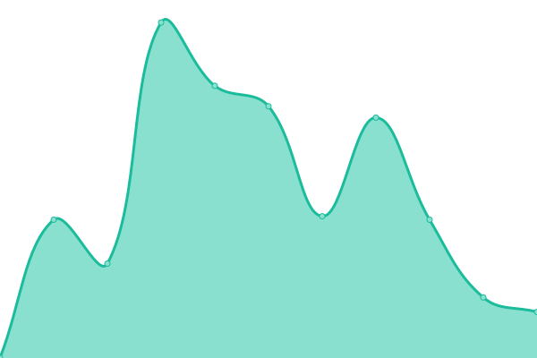
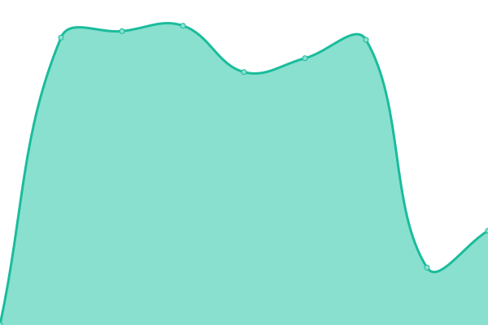
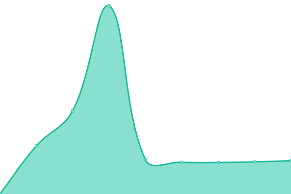
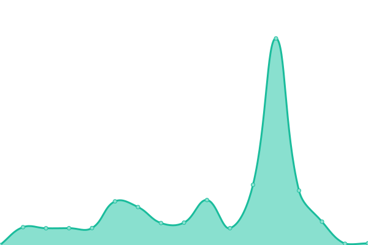
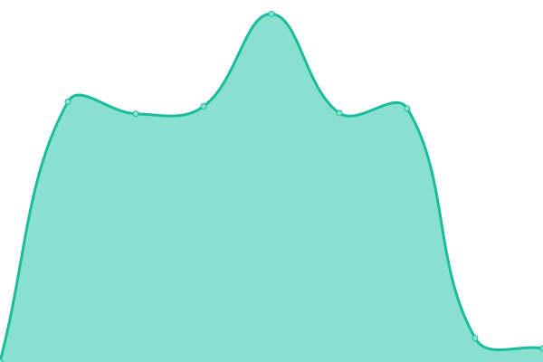

# [📈 Live Status](https://seomotop.github.io/uptime): <!--live status--> **🟧 Partial outage**

This repository contains the open-source uptime monitor and status page for [seomotop](https://seomotop.github.io/uptime), powered by [Upptime](https://github.com/upptime/upptime).

With [Upptime](https://upptime.js.org), you can get your own unlimited and free uptime monitor and status page, powered entirely by a GitHub repository. We use [Issues](https://github.com/seomotop/uptime/issues) as incident reports, [Actions](https://github.com/seomotop/uptime/actions) as uptime monitors, and [Pages](https://seomotop.github.io/uptime) for the status page.

<!--start: status pages-->
<!-- This summary is generated by Upptime (https://github.com/upptime/upptime) -->
<!-- Do not edit this manually, your changes will be overwritten -->
<!-- prettier-ignore -->
| URL | Status | History | Response Time | Uptime |
| --- | ------ | ------- | ------------- | ------ |
|  [bk8.sarl](https://bk8.sarl) | 🟩 Up | [bk8-sarl.yml](https://github.com/seomotop/uptime/commits/HEAD/history/bk8-sarl.yml) | 

 1195ms
     
 | 

<a href="https://uptime.zamexperts.com/history/bk8-sarl">100.00%</a>
    

|  [scoreahit.com](https://scoreahit.com) | 🟩 Up | [scoreahit-com.yml](https://github.com/seomotop/uptime/commits/HEAD/history/scoreahit-com.yml) | 

 897ms
     
 | 

<a href="https://uptime.zamexperts.com/history/scoreahit-com">100.00%</a>
    

|  [luck8a.net](https://luck8a.net) | 🟩 Up | [luck8a-net.yml](https://github.com/seomotop/uptime/commits/HEAD/history/luck8a-net.yml) | 

 2176ms
     
 | 

<a href="https://uptime.zamexperts.com/history/luck8a-net">100.00%</a>
    

|  [qh88com.tel](https://qh88com.tel) | 🟥 Down | [qh88com-tel.yml](https://github.com/seomotop/uptime/commits/HEAD/history/qh88com-tel.yml) | 

 2535ms
     
 | 

<a href="https://uptime.zamexperts.com/history/qh88com-tel">99.42%</a>
    

|  [alibaba.com](https://alibaba333333.com) | 🟥 Down | [alibaba-com.yml](https://github.com/seomotop/uptime/commits/HEAD/history/alibaba-com.yml) | 

 0ms
     
 | 

<a href="https://uptime.zamexperts.com/history/alibaba-com">100.00%</a>
    

|  [78win.africa](https://78win.africa) | 🟩 Up | [78win-africa.yml](https://github.com/seomotop/uptime/commits/HEAD/history/78win-africa.yml) | 

 1149ms
     
 | 

<a href="https://uptime.zamexperts.com/history/78win-africa">100.00%</a>
    

<!--end: status pages-->

[**Visit our status website →**](https://seomotop.github.io/uptime)

## 📄 License

- Powered by: [Upptime](https://github.com/upptime/upptime)
- Code: [MIT](./LICENSE) © [Anand Chowdhary](https://anandchowdhary.com), supported by [Pabio](https://pabio.com)
- Data in the `./history` directory: [Open Database License](https://opendatacommons.org/licenses/odbl/1-0/)
